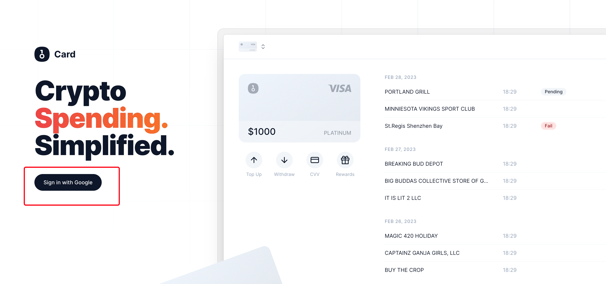

OneKey介绍
国内最大的冷钱包厂商Onekey这几天推出了Visa虚拟卡。因为OneKey Card支持Open AI的绑定，能够用来开通ChatGPT Plus，并且会比Depay容易不少。所以这几天很火，本教程就来教你如何一步步开通Onekey card。

先说一下，Onekey是做硬钱包出身，前不久刚完成A+轮融资，有纳斯达克上市的coinbase公司背书，这次进军虚拟卡业务，公测期间活动力度还是不小的。

注册Onekey Card

1.点击官网链接：[onekey](https://card.onekey.so/?i=NRH1LN)，进入注册界面,点击 [ sign in with Google ] ，直接使用谷歌账户注册。

2.账号注册后，点击[ Activate ]激活开通。卡片类型选VISA，目前是公测期间，只能通过邀请码来激活卡片。这里统一填写官方给定的邀请码：NRH1LN 【亲测，仍然有效】

实名KYC认证。按网页步骤进行实名认证，基本信息添加完毕后，点击 [ Next ]。此时需要完成人脸识别，点击 [ Please complete face verification ]，使用微信扫码进行自动验证。实名认证完成后，您的邮箱将收到一封实名认证完成的邮件。值得一提的是——凡是中心化的银行卡产品都需要做KYC认证，这是合规必须要面临的动作，不必有过多的顾虑。国内的身份几乎秒过，非国内的身份需要人工审核，一般提交之后一个工作日内会审核完的。

4.实名认证完成后，需要绑定 Google 身份验证器，才能开始使用，点击右上角3个点，选security，绑定google auth二次验证。安装谷歌验证码App并扫描二维码，抄写备份密钥（此密钥可让您在手机丢失时恢复您的 Google 身份验证器），输入谷歌验证码和邮箱验证码，完成绑定。

点击卡下方的top up，公测期间，充值至少20 USDC用于激活，目前只支持USDC，下面会说如何通过欧易平台充值。

充值Onekey Card
点击 USDC ，选择要充值的链进行充值。（暂时只支持USDC充值） 注意不是USDT，别选错，充值错代币很难追回，请注意充值正确的币种。

1. 获取Onekey的充值地址
点击加号Top up -->选择USDC -->选择TRX网络 -->拷贝USDC Address，比如我的地址是：TJBt3SxQbW9UaTapN6sSPR4Dxq3QBbHukq

2. 从欧易转USDC到Onekey
充值USDC，需要通过欧易平台，这是在国内比较容易购买到USDC/USDT的交易所。

首先，参考文章 国内开通Chat GPT Plus保姆级教程【典藏】中的 “申请欧易账号完成USDT充值”章节完成欧易注册以及USDT的充值过程。

完成了USDT充值后，在欧易App首页搜索USDC/USDT交易对，用USDT购买USDC，至少购买22个，因为有手续费磨损，稳妥起见，这里我购买50个。

点击资产-->提币-->搜USDC -->链上提币，这里提币地址填上面第1步从Onekey获取的地址，网络选USDC-TRC20，勾选交易账户，提交，手续费1USDC，大概等待20分钟不到，USDC就提到了你的OneKey钱包。

📢📢📢注意
需要注意的是，新注册的欧易用户默认完成身份认证后，需要等待24小时(有的人需要7天)才可以提现，如果你着急提现到Onekey Card，你可以尝试找一下人工客服，说下你的诉求，据群友反馈，有一定概率可以解除24小时等待。万一你真的特别着急，你也可以去微博上找代充，一般对方会按照汇率1:8收点劳务费。不是很急的话建议耐心等待24小时就行，不必花这冤枉钱。
如果你充值被欧易冻结7天不愿意等的话，也可以试试[Binance](https://accounts.binance.com/zh-CN/register?ref=NPDX0O15)，最多只冻结24小时，不过需要(魔法网络)才能访问。

绑定Onekey卡到ChatGPT，然后升级到ChatGPT Plus的步骤这里就不赘述了，请直接移步到 《开通ChatGPT Plus》，记住IP一定要纯净，OpenAI对IP要求很严格。

祝你开通ChatGPT Plus顺利，好几个群友都说Onekey比Depay好开通。

